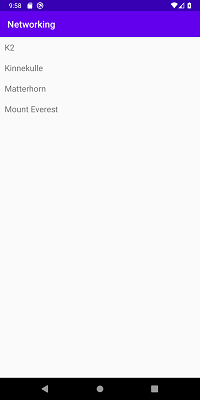
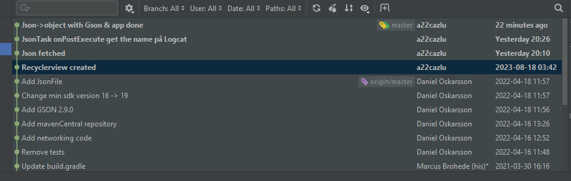

# Rapport

Denna uppgift var något svår att göra då koden inte riktigt ville arbeta med mig i den nyaste verisionen av Android studio så tid lades på att få ordning på det först. 



**Figur 1:** RecyclerView

En RecyclerView skapades först med att ta fram layouten i activity_main.xml och layouten för själva listan i list.xml. En lista skapades sedan i MainActivity.java med:
```
private final List<Mountain> mountains = new ArrayList<>();
```
I Mountain.java skapades variabler för varje delinformation som finns till de olika bergen, en getter för namnet och en ToString:
```
private String ID;
private String name;
...
public String getName() {
    return name;
}
@Override
public String toString() {
    return name;
}
```
I RecyclerViewAdapter finner man både adaptern och viewholdern. Viewholdern visar vart den hämtade informationen ska skrivas ut i layouten.

I onPostExecute används Gson för att omvandla Json till ett objekt som vi sedan kan visa upp via layouten, en for-loop som lägger till bergsnamnen i Mountainlistan och sist skrivs listan ut i RecyclerViewn. 
```
Gson gson = new Gson();
Mountain[] temp = gson.fromJson(json,Mountain[].class);
```
**PS:**
Jag har commitat fyra gånger men har missat att pushat dem till github:


